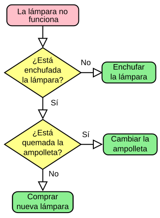

# Sistema Digital de Gestión de Biblioteca
---
1. Configuracion usuarios
    - usuarios activos
    - usuarios registrado pero no activos

2. Configuracion libros
3. configuracion de reportes

## RESUMEN 

Este proyecto desafía a los estudiantes a desarrollar un sistema digital de gestión de biblioteca que migre el proceso manual de control de libros y usuarios a un sistemaautomatizado, integrando módulos de gestión de inventario, registro de usuarios, préstamos,devoluciones y reservas. Para lograrlo, los estudiantes deberán implementar algoritmos de búsqueda, validación y control de procesos, diseñar estructuras de datos en arreglos y matrices que permitan manejar de forma eficiente la información de la biblioteca, y aplicar
principios de programación estructurada para garantizar un flujo confiable. El proyecto aborda
problemas reales de la administración bibliotecaria como la duplicidad de registros, la falta de
control en inventarios, la ausencia de reportes, y la necesidad de un cálculo automático de
multas por atrasos. La solución requiere investigación autónoma en técnicas de validación,
modelado de información y diseño de menús interactivos en PSeInt, permitiendo a los
estudiantes fortalecer competencias en abstracción de procesos, organización de datos,
manejo de errores y construcción de sistemas funcionales orientados a la gestión digital.

``` py 
const User = sequelize.define('User', {
  email: {
    type: DataTypes.STRING,
    unique: true,
    allowNull: false,
  },
  password: {
    type: DataTypes.STRING,
    allowNull: false,
    set(value) {
      this.setDataValue('password', encrypt(value)); 
    },
  },
  firstName: {
    type: DataTypes.STRING,
    allowNull: false,
  },
  lastName: {
    type: DataTypes.STRING,
    allowNull: false,
  },
  phoneNumber: {
    type: DataTypes.STRING,
    allowNull: true, 
  },
});

```

### Diagrama para los usuarios
diagrama que representa los usuarios


***El vector esta limitado a 100 usuarios***
*El vector esta limitado a 100 usuarios*
**El vector esta limitado a 100 usuarios**


|ID|Nombre|canet|
|--|------|--------|
|01|Juan perez| 2025|
|01|Juan perez| 2025|
|01|Juan perez| 2025|
|01|Juan perez| 2025|
